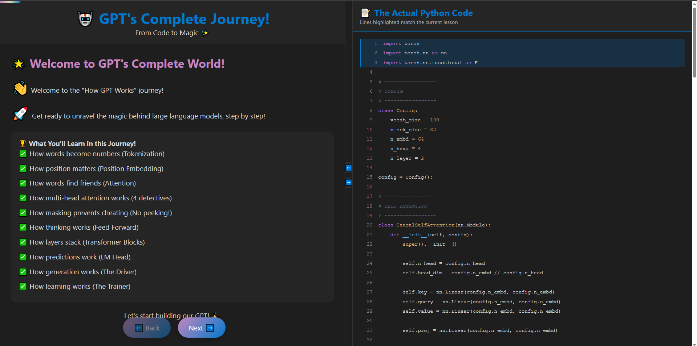

# 🤖 How GPT Works: An Interactive Journey

An immersive, gamified, and fully commented journey to understand the architecture of a GPT model from scratch, presented with a side-by-side code viewer. This project demystifies the magic behind Large Language Models by breaking down a complete, runnable mini-GPT into understandable, bite-sized lessons.

---

### ✨ [Live Demo - Click Here!](https://brat23.github.io/bratGPT/)

*(Note: For the live demo to work, you must enable GitHub Pages in your repository settings.)*

 

---

## 🚀 Project Scope & Features

This project is not just a code repository; it's a hands-on educational tool designed to make learning complex AI concepts intuitive and fun.

- **Interactive, Step-by-Step Lessons:** Progress through 16 stages, from basic configuration to the complete model architecture and training concepts.
- **Side-by-Side Code Viewer:** As you navigate through lessons on the left, the relevant lines of Python code are automatically highlighted on the right.
- **Complete, Runnable Code:** The displayed Python code is a complete, functional mini-GPT model built with PyTorch.
- **Responsive & Resizable UI:**
  - Drag the central bar to resize the lesson and code panels.
  - Toggle each panel to enter a "focus mode" for either reading the lesson or studying the code.
- **SOLID & Maintainable Structure:** The frontend code is built with SOLID principles, separating concerns into a clean, scalable, and easy-to-understand folder structure.
- **Easily Customizable:** The theme, lesson content, and even the Python code itself are designed to be easily tweaked and extended.

## 🏗️ Project Structure

The project follows a clean, component-based architecture, making it easy to maintain and scale.

```
how-gpt-works/
├── 📄 index.html             # The main and only HTML file (the "shell" of the app)
├── 📄 README.md              # You are here!
└── 📁 src/
    ├── 📁 css/
    │   ├── 📄 main.css        # Main layout, structure, and non-color-related styles
    │   └── 📄 theme.css        # All color variables (theming) are here!
    └── 📁 js/
        ├── 📁 config/
        │   ├── 📄 pythonCode.js # Holds the entire Python GPT code as a string
        │   └── 📄 stages.js     # The heart of the tutorial! All lesson content and highlight data
        ├── 📁 core/
        │   └── 📄 dom.js        # Simple DOM manipulation helpers (e.g., query selectors)
        ├── 📁 engines/
        │   ├── 📄 codeViewerEngine/
        │   │   ├── 📄 codeViewer.js # Logic for initializing and highlighting the code
        │   │   └── 📄 ui.js         # UI functions for the code viewer (e.g., creating lines)
        │   ├── 📄 layoutEngine.js   # Logic for resizing and toggling the panels
        │   └── 📄 learningEngine/
        │       ├── 📄 learningEngine.js # Core logic for navigating between stages
        │       └── 📄 ui.js           # UI functions for the learning panel (e.g., updating content)
        └── 📄 main.js              # The main entry point that initializes all engines
```

## 🛠️ How to Setup and View

This is a pure HTML, CSS, and JavaScript project. No complex setup is required!

1.  **Clone the repository:**
    ```bash
    git clone https://github.com/brat23/bratGPT.git
    ```
2.  **Navigate to the directory:**
    ```bash
    cd bratGPT
    ```
3.  **Open `index.html` in your browser:**
    - You can simply double-click the `index.html` file.
    - For the best experience (to avoid any potential CORS issues with modules), it's recommended to use a simple local server. If you have VS Code, the **Live Server** extension is a great one-click option.

## 🎨 How to Tweak and Customize

The project was designed to be easily configurable.

### Changing the Theme
All colors are located in `src/css/theme.css` as CSS variables. Simply change these values to create a whole new look!

```css
/* In src/css/theme.css */
:root {
    --primary-color: #007ACC;    /* Change the main highlight and header color */
    --background-color: #1E1E1E;  /* Change the app background */
    --keyword-color: #C586C0;     /* Change the color of Python keywords */
    /* ... and so on! */
}
```

### Modifying the Python Code
The entire Python script is stored in a single template literal string in `src/js/config/pythonCode.js`. You can edit this file to change the code being displayed.

**Important:** If you add or remove lines, you **must** update the `codeLines` arrays in `src/js/config/stages.js` to ensure the correct lines are highlighted for each lesson.

### Adding or Changing Lessons
All lesson content is stored in the `stages` array in `src/js/config/stages.js`. Each object in the array represents one step of the tutorial.

```javascript
// In src/js/config/stages.js
export const stages = [
    {
        title: "My New Lesson Title!", // The title of the lesson
        content: `
            <p>Here is my new lesson content.</p>
            <p>You can use any HTML you want!</p>
        `, // The lesson content (as an HTML string)
        codeLines: [10, 11, 12] // The line numbers to highlight in the code viewer
    },
    // ... more stages
];
```

## 🧠 How to Understand the Code

The application is initialized in `src/js/main.js`. It works by loading several "engines":
-   **`codeViewerEngine`**: Reads the Python code from `pythonCode.js`, splits it into lines, and renders it into the right-hand panel. It exposes a function to highlight specific lines.
-   **`learningEngine`**: Manages the `stages` array. It handles the "Next" and "Back" buttons to update the content in the left-hand panel and tells the `codeViewerEngine` which lines to highlight.
-   **`layoutEngine`**: Controls the resizing and toggling of the panels, independent of the other two engines.

This separation of concerns makes it easy to understand how each part of the application works in isolation.

## 🌟 Future Scope & Contributing

This project is a great foundation. Here are some ideas for future improvements:
-   **More Sophisticated Animations:** Add more engaging animations for transitions between stages.
-   **Quizzes:** Add a small quiz at the end of each stage to test understanding.
-   **Multiple Code Examples:** Add a dropdown to switch between different code examples (e.g., GPT, Stable Diffusion, etc.).
-   **i18n (Internationalization):** Add support for multiple languages.

Contributions are welcome! Please feel free to fork the repository, make your changes, and submit a pull request.

---

## 📜 License

This project is open-source and available under the [MIT License](LICENSE).
